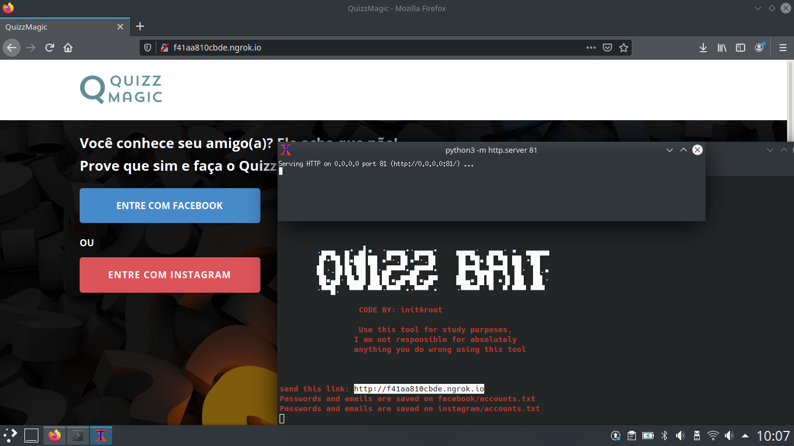

# QuizzPhisher

<h3> Welcome to Quizz Phisher </h3>
A program that automates the phishing process using a simple Quizz.
<h2> INSTALLATION </h2>

You need to have an account on ngrok to get your authtoken!

1° Make sure you have xterm installed, if not, install it!
\n Xterm (ubuntu/debian): sudo apt-get install xterm
Xterm (Fedora): dnf install xterm\n
Xterm (Manjaro/Arch): pacman -Syu xterm

2° Clone the repository on github and Install{

sudo git clone https://github.com/rootmoura/QuizzPhisher.git
cd QuizzPhisher
sudo su
pip3 -r install requirements.txt
python3 QuizzPhisher.py
}

<h2> I am not responsible for your actions using this application, take it easy! </h2>

